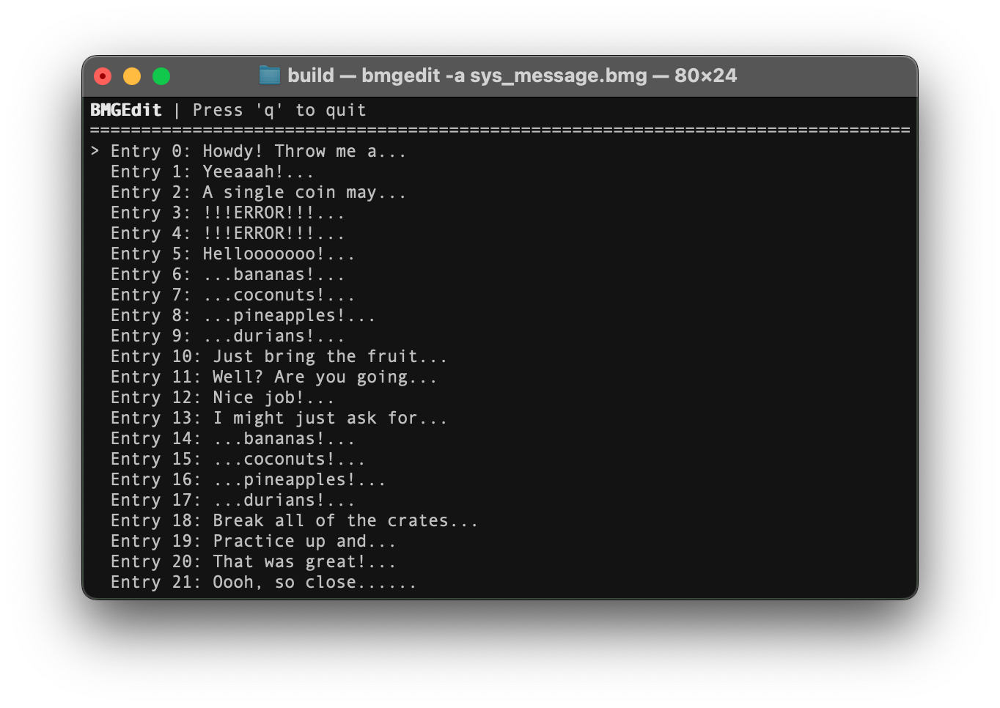

# BMGEdit

BMGEdit is a command-line tool for editing Super Mario Sunshine's BMG files.

Maybe in the future, it will support more BMG types.

## Usage

You can simply run `bmgedit <filename>` to edit a file. There are flags for different features as well, run `bmgedit` by itself to see what they can do.

## Building

Right now, you need to build the code yourself. This project uses CMake, so set it up with `src` as the source directory and `build` as the build directory and use `make` to build it.

## Contributing

I'm not very good at programming in C++, and I've only tested this on macOS, so feel free to contribute and help me improve.
